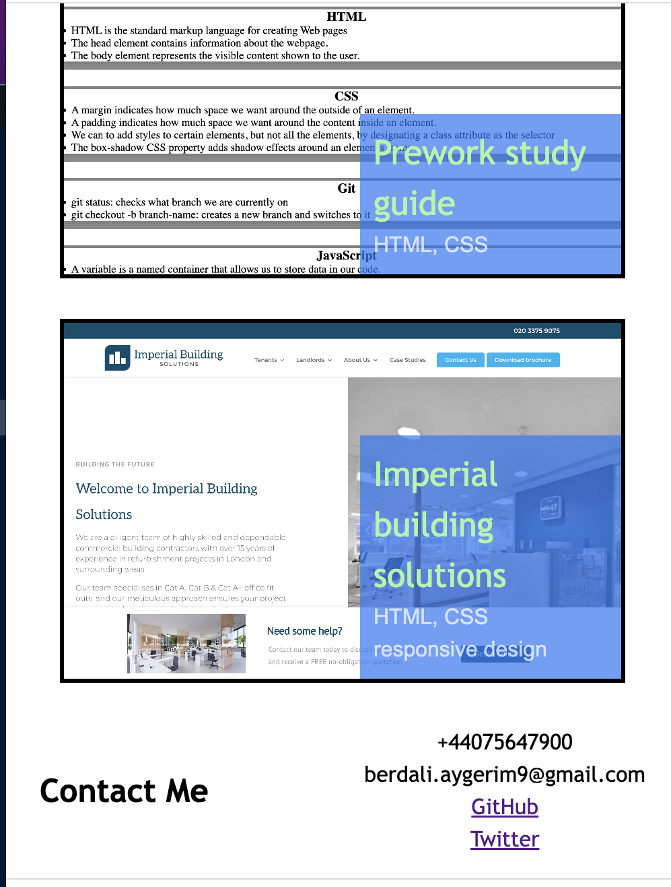

# My_portfolio
## My portfolio website

This portfolio website showcase my undestarding of new core skills I learned last two weeks: flexbox, media queries, grid and CSS variables. 

## Installation 

## Usage

The following image shows the web application's appearance and functionality:

Navigate to <https://anarab.github.io/my_portfolio/> to find the  webpage. 

## Credits
GitHub page
<https://github.com/AnaraB>

Please note, that in order to fill the work sections with projects and showcase my knowledge of a grid, I borrowed three websites, developed by other proffessional web developers. So, Meditation club, Cake shop and Imperial Building Solution websites are not my work :) I will replace them with my own projects very soon. 

## License
MIT 
